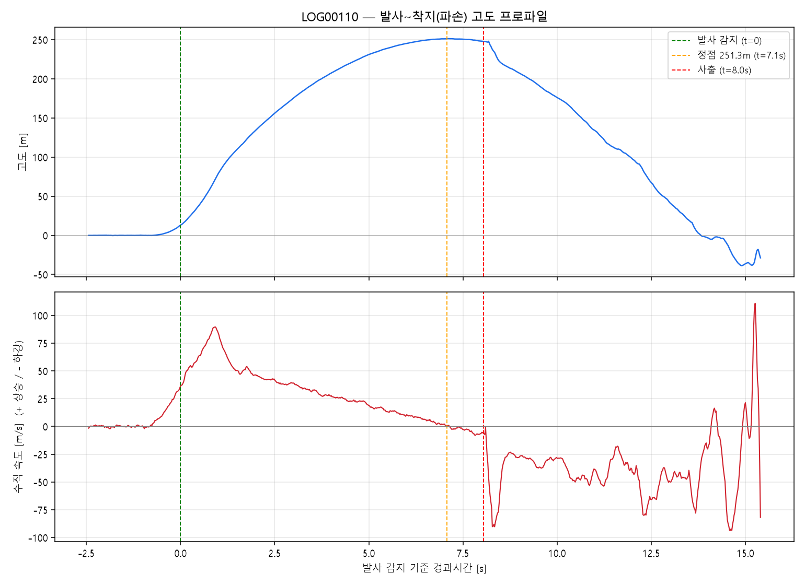

# 테스트 발사 결과 공유 — 구조팀

**날짜**: 2026-08-02 테스트 발사

---

## 1. 결과 요약

발사는 정상적으로 진행됐고, 최고고도(약 251m) 도달 후 사출 명령도 정상 실행됨. 다만 낙하산이 펼쳐지지 않아 로켓이 빠른 속도로 지면에 낙하, 기체 파손됨.

전자부·소프트웨어·서보모터는 데이터 분석 결과 전부 정상 작동한 것으로 확인됨. **노즈콘이 열리는 마지막 단계**가 원인일 가능성이 높음.

## 2. 사출 메커니즘 및 상황 정리

사출 구조: 서보모터 회전 → 핀 이동 → 스프링 힘으로 노즈콘(좌우 반분할)에 힘 전달 → 정상 작동 시 반시계로 열리며 낙하산 전개.

- 데이터상 서보모터는 정상 회전, 결합부(글루건 고정)도 이상 없음
- 이전 강의실 지상시험에서도 낙하산을 실제로 넣은 상태에서는 뚜껑이 뻑뻑해서 잘 안 열리는 경우가 종종 있었음
- 이번에 사용한 노즈콘은 신규 3D프린트품으로, 낙하산 적재 상태 사출시험은 아직 거치지 않은 상태였음

→ 종합하면 **낙하산 적재 시 노즈콘이 벌어지는 데 필요한 힘/여유 공간이 부족했을 가능성**이 높음. 전자·서보 쪽 문제는 아닌 것으로 판단됨.

## 3. 비행 데이터 요약

| 항목 | 값 |
|---|---|
| 최고고도 | 251.34 m (발사 후 7.08초) |
| 평균 상승속도 | 33.7 m/s |
| 사출 시점 고도 | 247.83 m (정점 대비 -3.51m) |
| 정점~지면 낙하시간 | 6.64초 |
| 평균 하강속도 | **37.2 m/s (시속 약 134km)** |
| 정상 낙하산 전개 시 기준 하강속도 | 5~7 m/s |

정상 대비 5배 이상 빠른 속도로 그대로 지면 도달 — 낙하산 미전개가 데이터로 명확히 확인됨.

## 4. 확인 요청 사항

1. 노즈콘 반분할 결합부(뚜껑 열림 구조) 공차 — 빈 상태가 아니라 **낙하산을 실제로 넣은 상태 기준**으로 재검토 필요
2. 스프링 힘이 낙하산 적재 시 마찰까지 감안해도 충분한지 확인 필요 (필요시 강성 상향 또는 마찰 저감 형상/코팅 검토)
3. 향후 신규/변경 부품은 **낙하산 적재 상태 사출시험 통과 후 비행 투입**을 공통 절차로 정하면 좋을 것 같음
4. 재발사 전 낙하산 적재 상태로 지상 사출시험 반복 실시, 매회 정상 개방 확인 필요
